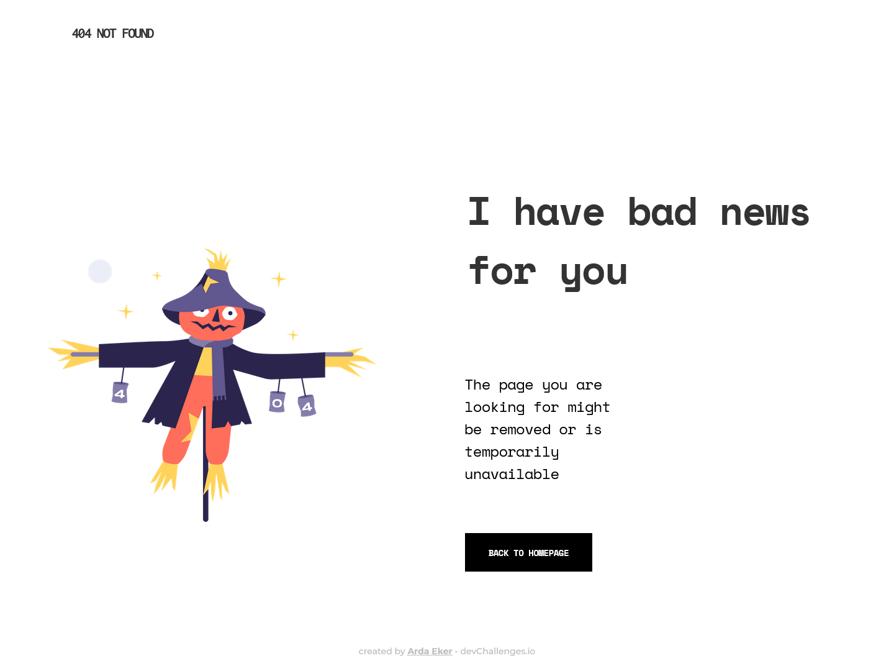
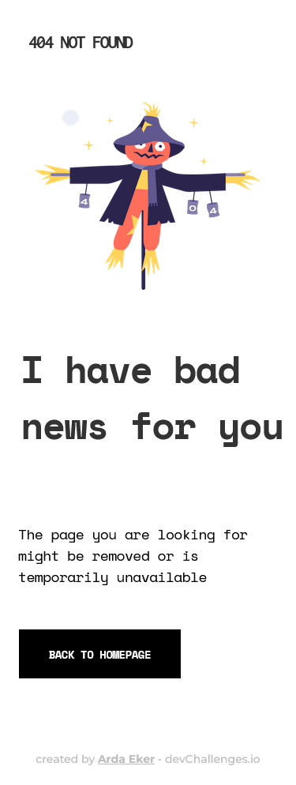

<!-- Please update value in the {}  -->

<h1 align="center">404 Not Found Challenge</h1>

   Solution for a challenge from  <a href="http://devchallenges.io" target="_blank">Devchallenges.io</a>.

  <h3>
    <a href="https://ardaekerdevchallenges-01.netlify.app/">
      Demo
    </a>
     | 
    <a href="https://devchallenges.io/solutions/GwxQDKwvNw6wR9DNmcjG">
      Solution
    </a>
     | 
    <a href="https://devchallenges.io/challenges/wBunSb7FPrIepJZAg0sY">
      Challenge
    </a>
  </h3>

<!-- TABLE OF CONTENTS -->

## Table of Contents

- [Table of Contents](#table-of-contents)
- [Overview](#overview)
- [Features](#features)
- [Contact](#contact)

<!-- OVERVIEW -->

## Overview

## Features

This application/site was created as a submission to a [DevChallenges](https://devchallenges.io/challenges) challenge. The [challenge](https://devchallenges.io/challenges/wBunSb7FPrIepJZAg0sY) was to build an application to complete the given user stories.

## Contact

- LinkedIn [@ardaeker](https://www.linkedin.com/in/ardaeker/)
- GitHub [@ardaeker](https://github.com/ardaeker)
- Frontend Mentor - [@ardaekerFD](https://www.frontendmentor.io/profile/ardaekerFD)
